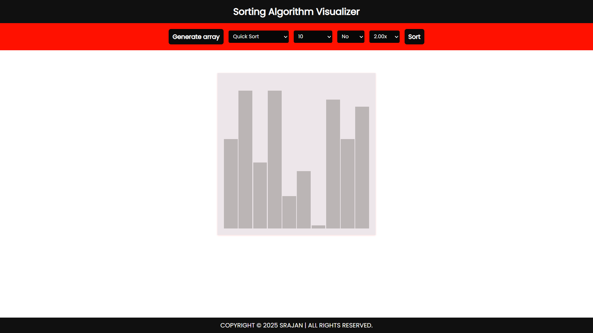
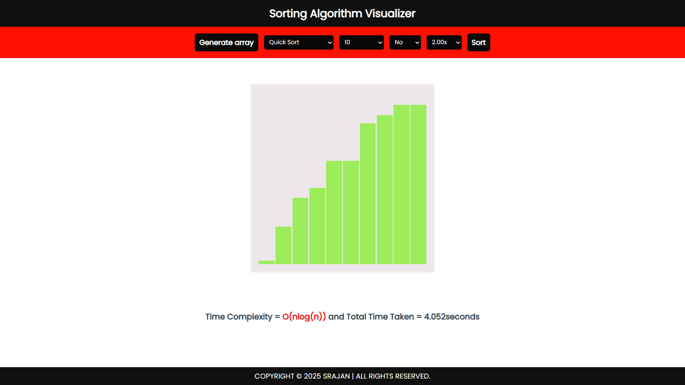

# 🔍 Sorting Algorithm Visualizer

An interactive web-based tool to **visualize and compare the behavior of sorting algorithms** in real time. Built using **HTML, CSS, and JavaScript**, this project helps users understand the step-by-step process of popular sorting algorithms through animated bars and color cues.
Try it Live: https://srajanx7.github.io/Sorting-Visualizer/ 

---

## 📸 Demo

> 🎥 **Before Sorting (Unsorted Random Array)**  

> 🎥 **After Sorting (Sorted Array using Quick Sort)**  

---

## 🧠 Algorithms Implemented

This visualizer supports the following sorting algorithms:

- 🔁 Bubble Sort  
- 🔽 Insertion Sort  
- 🧩 Selection Sort  
- ⚡ Quick Sort  
- 🔀 Merge Sort

---

## 🚀 Features

- 🎲 **Random Array Generator** – Instantly create a new unsorted array with adjustable size and values.  
- 🎮 **Control Panel** – Start, pause, or reset the sorting; select any algorithm from the dropdown.  
- 🎨 **Color-coded Visualization** – Highlight current comparisons, swaps, and sorted elements.  
- 🐢🐇 **Speed Control** – Modify animation speed from slow (step-by-step) to fast execution.  
- 📱 **Responsive Design** – Works smoothly across desktops, tablets, and mobile screens.

---

## ⚙️ Tech Stack

- **HTML5** – Structure and semantic layout  
- **CSS3** – Visual styling and animations  
- **JavaScript (Vanilla)** – Core logic, DOM manipulation, and animations
